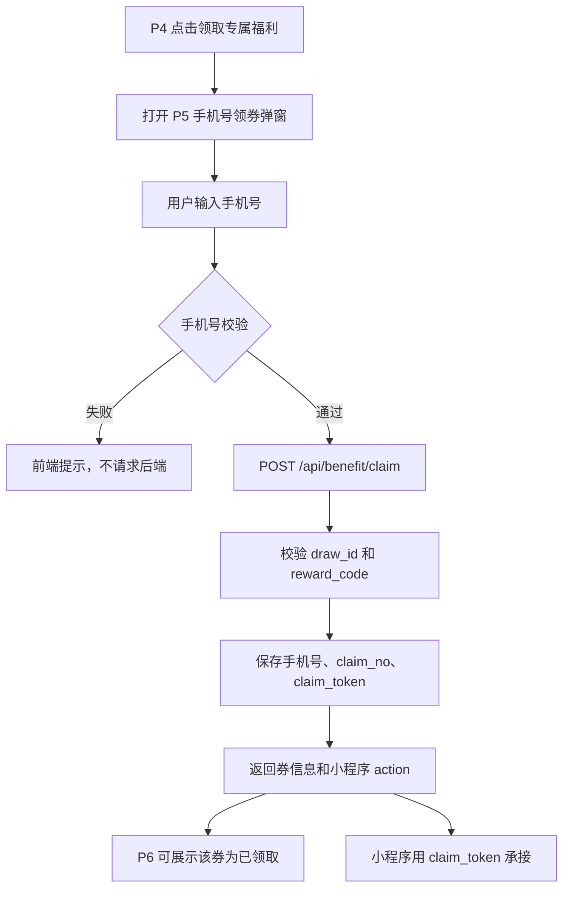

# H5 活动数据库设计

> 更新时间：2026-05-21  
> 当前阶段使用 SQLite 做本地开发数据库。后续迁移到 MySQL 时，表名、字段名、业务约束保持一致，只替换字段类型和建表语法。P5 最新领券逻辑要求在 `reward_claim_record` 中保存手机号、领取凭证和发券状态。

## 1. 设计边界

本数据库只服务本次高考 H5 活动，不写入商城核心库。

数据链路：

```txt
H5 前端 -> Python FastAPI 活动后端 -> SQLite 活动库
```

后续如果接入商城能力，例如券包页、商品详情页、真实发券，活动后端只保存活动侧记录，并通过小程序/商城接口使用 `claim_token` 或 `claim_no` 承接，不让前端和 URL 直接传手机号明文。

## 2. SQL 文件规划

```txt
database/
  sqlite/
    001_init_activity_tables.sql
    002_seed_basic_mock_config.sql
    003_optimize_activity_tables.sql
  mysql/
    001_init_activity_tables.sql
    002_seed_basic_mock_config.sql
```

本地 SQLite 数据库建议放在：

```txt
backend/data/gaokao_h5_dev.sqlite3
```

当前脚本已能支撑首轮主流程。P5 手机号领券新逻辑需要补一份 SQLite/MySQL 同步迁移，新增字段见第 5 节。

## 3. 表总览

| 表名 | 模块 | 作用 |
| --- | --- | --- |
| `activity_config` | 活动配置 | 保存活动基础配置、时间、开关、默认抽签机会 |
| `activity_asset_config` | 图片配置 | 保存企微二维码、礼盒图、活动图等可配置图片 URL |
| `product_recommend_config` | 商品配置 | 保存 P6 精选好物图片、标题、卖点和跳转 action |
| `reward_config` | 奖励配置 | 保存 10 元、20 元、30 元、9 折、7.5 折、985 礼盒等奖励配置 |
| `draw_result_config` | 签文配置 | 保存抽签结果、宜忌、AI 解签文案和关联福利 |
| `activity_user` | 用户 | 保存活动用户身份，不依赖商城核心用户表 |
| `activity_session` | 会话 | 保存 H5 会话、入口来源、分享归因 token |
| `user_daily_state` | 每日状态 | 保存用户当天机会、分享奖励次数、已用次数、剩余次数和是否点亮 |
| `draw_record` | 抽签 | 保存每次抽签结果、`draw_id`、消耗机会 |
| `draw_chance_log` | 机会流水 | 保存每日默认机会、分享加机会、抽签扣机会 |
| `checkin_record` | 打卡点亮 | 保存每日点亮记录，每天最多 1 条 |
| `share_record` | 分享行为 | 保存用户分享行为和 `share_token` |
| `share_assist_record` | 好友助力 | 保存好友通过分享进入并完成抽签后的助力关系 |
| `reward_claim_record` | 奖励领取 | 保存每次抽签对应的领券记录、手机号、领取凭证和发券状态 |
| `grand_prize_qualification` | 985 资格 | 保存大奖资格、抽奖编号、开奖状态 |
| `tracking_event` | 埋点 | 保存页面曝光、点击和异常事件 |

## 4. 关键业务规则

1. 每个用户每日默认 1 次抽签机会，由 `draw_chance_log` 记录 `daily_default` 流水。
2. 用户分享后可以增加抽签机会，每日最多 3 次额外机会。
3. 当天总抽签机会最多 4 次：1 次默认机会 + 3 次分享额外机会。
4. 抽签成功后写入 `draw_record`，同步扣减机会，并自动写入当天点亮记录。
5. 同一用户同一天最多点亮 1 天，由 `checkin_record` 唯一约束保证。
6. 好友通过 `share_token` 进入并完成抽签后，写入 `share_assist_record`，同一好友只给同一原用户助力 1 次。
7. 分享 5 个好友或累计点亮 7 天，任一条件满足即可写入或更新 `grand_prize_qualification` 为达标。
8. 每次成功抽签都可以领取一次本次签文绑定的优惠券；P5 券在 `POST /api/draw/execute` 创建 draw 时固定写入 `draw_record.result_summary_json.reward_code` / `rewardCode`。
9. 同一 `draw_id + reward_code` 只能领取一次；不同 `draw_id` 可以重复领取同一 `reward_code`。
10. P5 输入手机号并领券成功后，才写入或确认 `reward_claim_record` 成功记录。
11. P6 的 `claimed_rewards` 只读取领取成功的数据。
12. P6 的 `display_rewards` 固定展示 5 张普通奖励配置 + 最后一张 985 礼盒；普通奖励未领取显示「未领取」，已领取显示「去领取」，985 达标显示「去使用」。
13. 985 礼盒始终展示在最后一个，未达标显示「未达标」，达标显示「去使用」。
14. P8 抽奖编号由后端生成并保存到 `grand_prize_qualification.lottery_no`，前端不能本地生成。

## 5. P5 手机号领券字段

`reward_claim_record` 需要支持以下字段。当前 SQLite/MySQL 脚本已补齐这些字段，后续新环境按迁移脚本同步即可。

| 字段 | 类型建议 | 说明 |
| --- | --- | --- |
| `claim_no` | `TEXT` / `VARCHAR(64)` | 领取单号，给活动后台和小程序排查使用 |
| `receiver_mobile` | `TEXT` / `VARCHAR(32)` | 用户输入手机号，活动后端保存 |
| `receiver_mobile_masked` | `TEXT` / `VARCHAR(32)` | 脱敏手机号，用于前端展示和日志 |
| `claim_token` | `TEXT` / `VARCHAR(128)` | 小程序承接 token，唯一 |
| `coupon_issue_status` | `TEXT` / `VARCHAR(16)` | 商城发券状态：`pending/success/failed` |
| `coupon_issue_error` | `TEXT` | 发券失败原因，排查用 |
| `external_coupon_id` | `TEXT` / `VARCHAR(128)` | 商城侧券 ID |
| `external_member_id` | `TEXT` / `VARCHAR(128)` | 商城会员 ID，可由手机号匹配后回写 |
| `claim_channel` | `TEXT` / `VARCHAR(32)` | 领取渠道，当前为 `h5` |

建议约束和索引：

| 类型 | 字段 | 说明 |
| --- | --- | --- |
| 唯一约束 | `activity_code, user_id, draw_id, reward_code` | 防止同一次抽签重复领同一张券 |
| 唯一约束 | `activity_code, claim_token` | 小程序通过 token 唯一解析领取记录 |
| 普通索引 | `activity_code, receiver_mobile` | 按手机号排查领取记录 |
| 普通索引 | `activity_code, coupon_issue_status, created_at` | 排查待发券、失败发券 |

## 6. P5 数据流



隐私要求：

1. URL 不传手机号明文。
2. 埋点不传手机号明文。
3. 前端只展示脱敏手机号。
4. 后端日志如需打印手机号，只打印脱敏值。

## 7. 图片配置规则

数据库不保存图片文件本体，只保存图片 URL 和业务配置。

| 图片类型 | 推荐位置 | 说明 |
| --- | --- | --- |
| 页面固定背景、按钮装饰 | 前端 `public/assets` | 不需要运营配置的静态视觉素材 |
| 企微二维码 | `activity_asset_config` | 例如 `asset_key = p8_wechat_qrcode` |
| 985 礼盒图 | `activity_asset_config` 或 `reward_config.reward_image_url` | 礼盒图可配置，便于替换 |
| 奖励券图 | `reward_config.reward_image_url` | 奖励配置级图片 |
| 精选好物图 | `product_recommend_config.product_image_url` | 商品推荐配置级图片 |

上线后建议把可配置图片替换为 CDN 或对象存储 URL。

## 8. SQLite 到 MySQL 迁移原则

| SQLite | MySQL |
| --- | --- |
| `INTEGER PRIMARY KEY AUTOINCREMENT` | `BIGINT AUTO_INCREMENT PRIMARY KEY` |
| `TEXT` | `VARCHAR` / `TEXT` |
| `INTEGER` | `INT` / `BIGINT` |
| `REAL` | `DECIMAL` |
| `DATETIME` 文本 | `DATETIME` |
| `CREATE UNIQUE INDEX` | `UNIQUE KEY` |

迁移时保持：

1. 表名不变。
2. 字段名不变。
3. 唯一约束不变。
4. 业务状态枚举不变。
5. 接口返回字段不变。

## 9. 后续开发顺序

1. 补 SQLite 和 MySQL 的 P5 字段迁移脚本。
2. 后端 `POST /api/benefit/claim` 增加 `mobile` 校验、保存、脱敏、`claim_token` 生成。
3. 前端 P4 点击福利改为打开 P5 弹窗。
4. 前端 P5 提交成功后再更新领取状态和 P6 展示。
5. 增加 P5 单元测试、接口测试和埋点测试。
