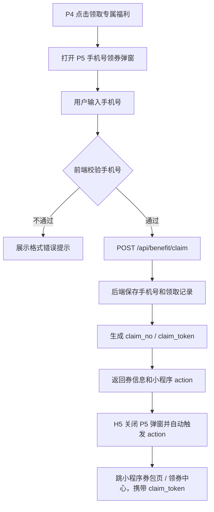

# P5 手机号领券弹窗确认版 + Agent 交付卡 v1.1

> 页面名称：P5 手机号领券弹窗 / 优惠券领取承接层  
> 项目：高考考运摇签 + 牛肉福利领取 H5 活动  
> 视觉基准：最新 P5 弹窗设计稿，米金底卡 + 手机号输入框 + 红色优惠券卡 +「去领取」按钮  
> 当前实现状态：前后端已按“先输入手机号再提交领券”完成改造，P4 点击只打开 P5 弹窗，P5 提交成功后生成 `claim_no` / `claim_token`，并自动承接到小程序券包 / 领券中心。

---

## 一、P5 最新业务口径

| 序号 | 确认项 | 当前结论 |
|---|---|---|
| 1 | 页面定位 | 用户点击 P4「领取专属福利」后打开 P5，输入手机号领取优惠券 |
| 2 | 前置来源 | P4 AI 解签结果页的「领取专属福利」按钮 |
| 3 | 页面主标题 | 固定展示「领取优惠券」 |
| 4 | 输入信息 | 必须输入手机号，手机号用于活动后端保存领取人信息和后续商城发券识别 |
| 5 | 奖励类型 | 当前展示优惠券，P5 轮换池包含 10 元券、20 元券、30 元券、9 折券、7.5 折券五张 |
| 6 | 主按钮 | 固定展示「去领取」 |
| 7 | 页面职责 | 收集手机号、提交领券；成功后关闭 H5 弹窗并自动跳小程序券包 / 领券中心 |
| 8 | 后端记录 | `reward_claim_record` 保存手机号、领取单号、领取 token、发券状态 |
| 9 | 小程序承接 | 跳小程序时传 `claim_token` / `claim_no`，不传手机号明文 |
| 10 | P6 展示关系 | 只有 `POST /api/benefit/claim` 成功后，P6 才认为该券已领取 |
| 11 | 未领取状态 | 只打开弹窗但未提交手机号，不生成领取成功记录 |
| 12 | 复用范围 | P5 仅处理券类手机号领取；985 礼盒资格仍走 P8 |

---

## 二、核心流程



---

## 三、页面元素与业务含义

| 页面元素 | 业务含义 | 备注 |
|---|---|---|
| 米金背景卡 | 承载手机号领券弹窗 | 视觉容器 |
| 关闭按钮 | 关闭弹窗，返回 P4 | 不写入领取成功记录 |
| 「领取优惠券」标题 | 当前动作说明 | 固定文案 |
| 手机号输入框 | 收集领取手机号 | 必填，11 位手机号 |
| 优惠券卡 | 展示本次可领取奖励 | 金额、门槛建议支持动态 |
| 「去领取」按钮 | 提交手机号并领取 | 点击后调用后端 |
| 成功承接 | 提交成功后自动跳小程序券包 / 领券中心 | 不在 H5 停留成功态 |
| 去领取动作 | 跳小程序券包 / 领券页 | 使用 `claim_token` 识别 |

---

## 四、接口设计

### 4.0 POST /api/benefit/randomize

用途：旧入口兼容和异常恢复。返回当前 `draw_id` 在抽奖时已经固定的 P5 优惠券，不重新随机、不重新绑定、不排除当前券。

请求体：

```json
{
  "session_token": "string",
  "draw_id": 123
}
```

响应体：返回 P4 `benefit` 结构，前端使用 `benefit.reward.imageUrl` / `benefit.reward.image_url` 渲染 P5 券图。

固定券口径：

1. 当前允许 `coupon_10`、`coupon_20`、`coupon_30`、`discount_9`、`discount_75` 五张券。
2. `coupon_10` 也是券池中的可配置券图，不再作为固定兜底券。
3. 券在 `POST /api/draw/execute` 创建 draw 时固定写入 `draw_record.result_summary_json.reward_code` / `rewardCode`。
4. 同一 `draw_id` 反复打开 P5 必须保持同一张券；重新抽签生成新 `draw_id` 才可能换券，避免用户通过反复开关弹窗刷更高券。
5. `POST /api/benefit/claim` 必须校验传入 `reward_code` 与 draw 固定券一致，不一致直接拒绝。

图片配置口径：

1. 首选 `reward_config.ext_json.p5_image_url`。
2. 其次 `activity_asset_config.fallback_url`，例如 `coupon_20_image` 对应 `/assets/p5/element_coupon_20yuan_card.png`。
3. 最后兜底 `reward_config.reward_image_url`。
4. 前端不维护 P5 券码到图片的硬编码表，替换图片只改配置，不改 Vue 代码。

### 4.1 POST /api/benefit/claim

用途：提交手机号并领取当前抽签结果绑定的优惠券。

请求体：

```json
{
  "session_token": "string",
  "draw_id": 123,
  "reward_code": "coupon_10",
  "mobile": "13812345678",
  "claim_channel": "h5"
}
```

响应体：

```json
{
  "activity_id": "gaokao_lucky_sign_2026",
  "session_id": "string",
  "draw_id": 123,
  "benefit_id": "default-benefit",
  "claim_id": "123",
  "claim_no": "CL202605210001",
  "claim_token": "ct_7d9f2c...",
  "claim_status": "claimed",
  "receiver_mobile_masked": "138****5678",
  "coupon_issue_status": "pending",
  "reward": {
    "reward_type": "coupon",
    "coupon_id": "coupon_10",
    "coupon_label": "优惠券",
    "threshold_text": "无门槛",
    "amount": 10,
    "amount_text": "10",
    "unit_text": "元券",
    "coupon_name": "无门槛10元券",
    "coupon_status": "unused"
  },
  "action": {
    "button_text": "去领取",
    "type": "mini_program_coupon_package",
    "target": "/pages/coupon-package/index?claim_token=ct_7d9f2c&claim_no=CL202605210001"
  }
}
```

### 4.2 GET /api/benefit/claim/result

用途：H5 重新查询领取结果。

参数：

| 字段 | 必填 | 说明 |
|---|---|---|
| `session_token` | 是 | H5 会话 |
| `claim_no` | 是 | 领取单号 |

返回字段同 `POST /api/benefit/claim`。

### 4.3 GET /api/benefit/claim/resolve（后续给小程序）

用途：小程序用 `claim_token` 解析领取记录和发券状态。

参数：

| 字段 | 必填 | 说明 |
|---|---|---|
| `claim_token` | 是 | 领取 token |

说明：

1. 小程序不从 URL 获取手机号明文。
2. 小程序通过 `claim_token` 调后端解析手机号、奖励、发券状态。
3. 如商城已有会员体系，可在后端用手机号匹配 `member_id` 或调用商城发券接口。

---

## 五、数据库字段口径

`reward_claim_record` 需要新增或确认以下字段：

| 字段 | 说明 |
|---|---|
| `receiver_mobile` | 用户输入手机号，活动后端保存 |
| `receiver_mobile_masked` | 脱敏手机号，用于前端展示和日志 |
| `claim_token` | 给小程序承接识别领取记录 |
| `coupon_issue_status` | 商城发券状态：`pending/success/failed` |
| `external_coupon_id` | 商城发券记录 ID |
| `external_member_id` | 商城会员 ID，可后续补 |
| `coupon_issue_error` | 发券失败原因 |

安全要求：

1. 埋点不上传手机号明文。
2. URL 不携带手机号明文。
3. 后端日志如需打印手机号，只打印脱敏值。

---

## 六、状态逻辑

| 状态 | 页面表现 | 动作 |
|---|---|---|
| 初始 | 显示手机号输入框、优惠券卡、去领取按钮 | 等待输入 |
| 手机号为空 | 输入框下方提示「请输入手机号」 | 不调接口 |
| 手机号格式错误 | 提示「请输入正确手机号」 | 不调接口 |
| 提交中 | 按钮 loading / 禁用 | 防重复提交 |
| 领取成功 | 保存 claim 信息，自动触发小程序 action | 不停留 H5 成功弹窗 |
| 已领取重复提交 | 返回已有领取记录 | 不重复发券 |
| 领取失败 | 显示错误提示 | 可重试 |
| 关闭弹窗 | 返回 P4 | 不生成领取成功记录 |

---

## 七、埋点事件

| 事件名 | 触发时机 | 参数 |
|---|---|---|
| `benefit_mobile_popup_view` | 弹窗曝光 | session_id、draw_id、benefit_id、reward_code |
| `benefit_mobile_input_focus` | 输入框聚焦 | session_id、draw_id、benefit_id |
| `benefit_mobile_submit_click` | 点击去领取 | session_id、draw_id、benefit_id、reward_code、mobile_valid |
| `benefit_mobile_validate_fail` | 手机号校验失败 | session_id、draw_id、benefit_id、error_code |
| `exclusive_benefit_claim_success` | 后端领券成功 | session_id、draw_id、benefit_id、claim_no、claim_status |
| `exclusive_benefit_claim_fail` | 后端领券失败 | session_id、draw_id、benefit_id、error_code、error_msg |
| `benefit_claim_result_render_success` | 成功结果渲染 | session_id、benefit_id、claim_no、reward_type、coupon_id |
| `coupon_card_exposure` | 优惠券卡曝光 | session_id、benefit_id、claim_no、coupon_id、coupon_name |
| `use_benefit_click` | 点击或自动触发小程序领券承接 | session_id、benefit_id、claim_no、coupon_id、action_type、action_target |

---

## 八、Agent 交付要求

### H5 前端 Agent

1. 按最新 P5 设计稿实现手机号领券弹窗。
2. P4 点击领取只打开 P5，不直接调领券接口。
3. 手机号输入框支持校验、错误提示、提交 loading。
4. 调用 `POST /api/benefit/claim` 时携带 `mobile`。
5. 成功后保存 `claim_no`、`claim_token`、券信息和 action。
6. 领取成功后才能让 P6 展示已领取券。

### 后端 Agent

1. `POST /api/benefit/claim` 必须校验并保存手机号。
2. 生成 `claim_no` 和 `claim_token`。
3. 同一用户、同一 draw、同一 reward 幂等返回同一领取记录。
4. 返回小程序 action，不在 action 中暴露手机号。
5. 预留商城发券状态字段。

### 埋点 Agent

1. 增加手机号弹窗曝光、输入聚焦、提交、校验失败事件。
2. 领取成功 / 失败事件不带手机号明文。
3. 去领取承接事件继续保留 action 信息。

### QA Agent

1. 验证未输入手机号不能提交。
2. 验证错误手机号不能提交。
3. 验证正确手机号可以提交并保存。
4. 验证重复提交不重复发券。
5. 验证小程序跳转只带 `claim_token` / `claim_no`。
6. 验证 P6 只展示领取成功后的券。

---

## 九、当前实现结果

1. P4 点击「领取专属福利」只打开 P5 手机号领券弹窗。
2. P5 弹窗包含手机号输入、优惠券卡和「去领取」主按钮。
3. `POST /api/benefit/claim` 已要求 `mobile` 并做后端校验。
4. `reward_claim_record` 已保存 `receiver_mobile`、`receiver_mobile_masked`、`claim_token`、`coupon_issue_status`。
5. 领取成功后跳小程序 action 只携带 `claim_token` / `claim_no`，不携带手机号明文。
